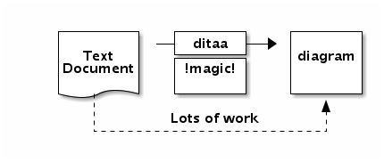

# [docker container for ditaa](http://ditaa.sourceforge.net/)

[](https://travis-ci.org/chai2010/ditaa-docker)
[](https://hub.docker.com/r/chai2010/ditaa/)
[](https://github.com/chai2010/ditaa-docker/blob/master/LICENSE)


- https://github.com/chai2010/ditaa-docker
- https://hub.docker.com/r/chai2010/ditaa
- https://github.com/stathissideris/ditaa
- http://ditaa.sourceforge.net

## Usage

```
# create txt file
$ cat << EOF > simple.txt
    +--------+   +-------+    +-------+
    |        | --+ ditaa +--> |       |
    |  Text  |   +-------+    |diagram|
    |Document|   |!magic!|    |       |
    |     {d}|   |       |    |       |
    +---+----+   +-------+    +-------+
        :                         ^
        |       Lots of work      |
        +-------------------------+
EOF

# generate png file
$ docker run --rm -it  -v `pwd`:/root chai2010/ditaa simple.txt output.png 
```

Output:



